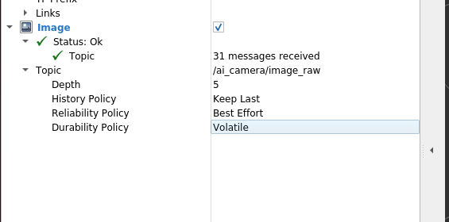

1. 加载初赛docker 
    `xhost +`
    `sudo docker run -it --shm-size="1g" --privileged=true -e DISPLAY=$DISPLAY -v /tmp/.X11-unix:/tmp/.X11-unix -v /home/ljl/cyberdogv2:/home/cyberdogv2 --name cyberdogv2  --dns=8.8.8.8 --dns=1.1.1.1 cyberdog_sim:v2`
2. 添加相机启动：/home/cyberdog_sim/src/cyberdog_simulator/cyberdog_robot/cyberdog_description/xacro/gazebo.xacro
    ```
    <!-- 以下为在gazebo中显示摄像头的代码，直接将其放在/home/cyberdog_sim/src/cyberdog_simulator/cyberdog_robot/cyberdog_description/xacro/gazebo.xacro下的<robot>标签里 -->
    <!-- RGB Camera -->
        <gazebo reference="RGB_camera_link">
            <sensor name="rgb_camera" type="camera">
                <always_on>true</always_on>
                <update_rate>30</update_rate>
                <visualize>true</visualize>
                <camera name="rgb_camera">
                    <horizontal_fov>1.3962634</horizontal_fov>
                    <image>
                        <width>640</width>
                        <height>480</height>
                        <format>R8G8B8</format>
                    </image>
                    <clip>
                        <near>0.02</near>
                        <far>300</far>
                    </clip>
                    <noise>
                        <type>gaussian</type>
                        <mean>0.0</mean>
                        <stddev>0.007</stddev>
                    </noise>
                </camera>
                <plugin name="rgb_camera_controller" filename="libgazebo_ros_camera.so">
                    <ros>
                        <remapping>~/image_raw:=rgb_camera/image_raw</remapping>
                        <remapping>~/camera_info:=rgb_camera/camera_info</remapping>
                    </ros>
                    <camera_name>rgb_camera</camera_name>
                    <frame_name>RGB_camera_link</frame_name>
                    <hack_baseline>0.07</hack_baseline>
                </plugin>
            </sensor>
        </gazebo>

        <!-- D435 Depth Camera -->
        <gazebo reference="D435_camera_link">
            <sensor name="d435_camera" type="depth">
                <always_on>true</always_on>
                <update_rate>30</update_rate>
                <visualize>true</visualize>
                <camera name="d435_camera">
                    <horizontal_fov>1.3962634</horizontal_fov>
                    <image>
                        <width>640</width>
                        <height>480</height>
                        <format>R8G8B8</format>
                    </image>
                    <clip>
                        <near>0.02</near>
                        <far>300</far>
                    </clip>
                    <noise>
                        <type>gaussian</type>
                        <mean>0.0</mean>
                        <stddev>0.007</stddev>
                    </noise>
                </camera>
                <plugin name="d435_camera_controller" filename="libgazebo_ros_camera.so">
                    <ros>
                        <remapping>~/image_raw:=d435_camera/image_raw</remapping>
                        <remapping>~/image_depth:=d435_camera/depth/image_raw</remapping>
                        <remapping>~/camera_info:=d435_camera/camera_info</remapping>
                        <remapping>~/camera_info_depth:=d435_camera/depth/camera_info</remapping>
                        <remapping>~/points:=d435_camera/depth/points</remapping>
                    </ros>
                    <camera_name>d435_camera</camera_name>
                    <frame_name>D435_camera_link</frame_name>
                    <hack_baseline>0.07</hack_baseline>
                </plugin>
            </sensor>
        </gazebo>

        <!-- AI Camera -->
        <gazebo reference="AI_camera_link">
            <sensor name="ai_camera" type="camera">
                <always_on>true</always_on>
                <update_rate>30</update_rate>
                <visualize>true</visualize>
                <camera name="ai_camera">
                    <horizontal_fov>1.3962634</horizontal_fov>
                    <image>
                        <width>1920</width>
                        <height>1080</height>
                        <format>R8G8B8</format>
                    </image>
                    <clip>
                        <near>0.02</near>
                        <far>300</far>
                    </clip>
                    <noise>
                        <type>gaussian</type>
                        <mean>0.0</mean>
                        <stddev>0.007</stddev>
                    </noise>
                </camera>
                <plugin name="ai_camera_controller" filename="libgazebo_ros_camera.so">
                    <ros>
                        <remapping>~/image_raw:=ai_camera/image_raw</remapping>
                        <remapping>~/camera_info:=ai_camera/camera_info</remapping>
                    </ros>
                    <camera_name>ai_camera</camera_name>
                    <frame_name>AI_camera_link</frame_name>
                    <hack_baseline>0.07</hack_baseline>
                </plugin>
            </sensor>
        </gazebo>
    ```

3. 在gazebo里查看：/ai_camera/image
```
source /opt/ros/galactic/setup.bash
python3 src/cyberdog_simulator/cyberdog_gazebo/script/launchsim.py 
```
4. 话题名：
    ```
    /ai_camera/camera_info
    /ai_camera/image_raw
    ```
5. 在rviz2显示，需要修改为下面的参数选项


### QoS
QoS（Quality of Service，服务质量）是ROS 2中的一个重要概念，用于控制消息传递的行为和特性。让我详细解释一下：

## QoS是什么？

QoS定义了消息传递的**可靠性**、**持久性**和**传递策略**。它决定了：
- 消息是否保证传递
- 消息如何存储和处理
- 网络延迟和带宽的使用方式

## 主要的QoS策略

### 1. **可靠性策略 (Reliability Policy)**
- **RELIABLE**: 保证消息传递，如果丢失会重传
- **BEST_EFFORT**: 尽力传递，不保证不丢失

### 2. **持久性策略 (Durability Policy)**
- **VOLATILE**: 只发送给当前连接的订阅者
- **TRANSIENT_LOCAL**: 新连接的订阅者可以收到最近的消息

### 3. **历史策略 (History Policy)**
- **KEEP_LAST**: 只保留最后N条消息
- **KEEP_ALL**: 保留所有消息

## 为什么会出现QoS不兼容？

在您的日志中看到：
```
[WARN] [qr_detector_node]: New publisher discovered on topic '/ai_camera/image_raw', offering incompatible QoS. No messages will be received from it.
```

这意味着：
- **发布者**（相机节点）使用了一种QoS设置
- **订阅者**（您的二维码检测节点）使用了不同的QoS设置
- 由于不兼容，无法接收消息

